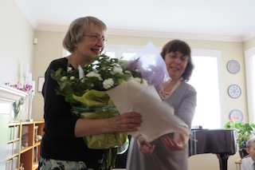

Current Students
================
type: page

- Mila Bobyreva [videos][mila]
- Arthur Bridson [videos][arthur]
- Eleanor Bridson [videos][eleanor]
- Elliot Bridson [videos][elliot]
- Mayya Chaykina [videos][mayya]
- Renan Dobrer [videos][renan]
- Tal-Claire Dobrer [videos][tal]
- David Fu
- Matthew Lai [videos][matthew]
- Raina Liao [videos][raina]
- Justine Lin [videos][justine]
- Grace Lokshin [videos][grace]
- Julia Polissky
- Ben Smus [videos][ben]
- Emma Tang
- Meg Wang [videos][meg]

[arthur]: https://www.youtube.com/results?search_sort=video_date_uploaded&filters=%40victoriasmusstudents&search_query=%22Arthur%20Bridson%22
[mila]: https://www.youtube.com/results?search_sort=video_date_uploaded&filters=%40victoriasmusstudents&search_query=%22Mila%20Bobyreva%22
[eleanor]: https://www.youtube.com/results?search_sort=video_date_uploaded&filters=%40victoriasmusstudents&search_query=%22Eleanor%20Bridson%22
[elliot]: https://www.youtube.com/results?search_sort=video_date_uploaded&filters=%40victoriasmusstudents&search_query=%22Elliot%20Bridson%22
[renan]: https://www.youtube.com/results?search_sort=video_date_uploaded&filters=%40victoriasmusstudents&search_query=%22Renan%20Dobrer%22
[tal]: https://www.youtube.com/results?search_sort=video_date_uploaded&filters=%40victoriasmusstudents&search_query=%22Tal-Claire%20Dobrer%22
[matthew]: https://www.youtube.com/results?search_sort=video_date_uploaded&filters=%40victoriasmusstudents&search_query=%22Matthew%20Lai%22
[raina]: https://www.youtube.com/results?search_sort=video_date_uploaded&filters=%40victoriasmusstudents&search_query=%22Raina%20Liao%22
[justine]: https://www.youtube.com/results?search_sort=video_date_uploaded&filters=%40victoriasmusstudents&search_query=%22Justine%20Lin%22
[grace]: https://www.youtube.com/results?search_sort=video_date_uploaded&filters=%40victoriasmusstudents&search_query=%22Grace%20Lokshin%22
[ben]: https://www.youtube.com/results?search_sort=video_date_uploaded&filters=%40victoriasmusstudents&search_query=%22Ben%20Smus%22
[kristy]: https://www.youtube.com/results?search_sort=video_date_uploaded&filters=%40victoriasmusstudents&search_query=%22Kristy%20Yang%22
[meg]: https://www.youtube.com/results?search_sort=video_date_uploaded&filters=%40victoriasmusstudents&search_query=%22Meg%20Wang%22
[mayya]: https://www.youtube.com/results?search_sort=video_date_uploaded&filters=%40victoriasmusstudents&search_query=%22Mayya%20Chaykina%22

# Events

## Canadian Music Competition, July 2015

Congratulations to Raina Liao, who made it to the national final and received
90% for her [performance](https://www.youtube.com/watch?v=yaHw55zZx98) in the
age 11 category for piano!

## Festival on the Lake, May 2015

- Raina Liao, Concerto Class, gold certificate
- Matthew Lai, Concert Group 8, gold certificate

## Student Performer's Guild Festival, May 2015

- Arthur Bridson, Own Choice 2, 1st place and trophy
- Mayya Chaykina, Concert Group 2, 1st place
- Matthew Lai, Own Choice 8, 1st place and trophy
- Matthew Lai, Technical Studies 8, 1st place
- Meg Wang, Classical Composers 10, 1st place
- Raina Liao, 20th Century Composers 10, 2nd place
- Grace Lokshin, Romantic Composers 10, 2nd place
- Elliot Bridson, Own Choice 4, 2nd place
- Ben Smus, Concert Group 9, 2nd place
- Meg Wang, Baroque 10, 3rd place

## Vancouver Kiwanis Festival, April 2015

- Elliot Bridson, Concert Group 4, 1st place
- Grace Lokshin, Baroque 10, 1st place
- Meg Wang, Classical Composers 10, 1st place
- Meg Wang, Impressionist Composers 10, 1st place
- Tal-Claire Dobrer, Concert Group 9, 2nd place
- Renan Dobrer, Concert Group 4, 2nd place
- Julia Polissky, Technical Studies ARCT, 2nd place
- Ben Smus, Concert Group 9, 2nd place
- Arthur Bridson, Concert Group 2, 3rd place
- Eleanor Bridson, Concert Group 1, 3rd place
- Mayya Chaykina, Concert Group 1, 3rd place
- Julia Polissky, Chopin ARCT, 3rd place

## Russian Music Festival, February 2015

- Raina Liao, Age 11 Category, 1st place and scholarship

## An Afternoon with Linda Niamath

A selection of music composed by Linda Niamath was played by beginners
and intermediate students. Pieces were sampled from the following books:
Surprises, Fancy Free, A Zoo for You, and Soda Pop and other Delights as
well as all pieces from "Outer Limits: Early Intermediate Piano Duets",
which can be purchased at [Granata][ol1], [Stanton's][ol2], and [AbeBooks][ol3].

**Solo program**

- Eleanor Bridson: **Lonely Princess, Ice Cream Cones, Party Hats**
  [video](http://youtu.be/z0o8v-IYhyw)
- Arthur Bridson: **Tiger, Kangaroos, March of the Terrible Trolls**
  [video](http://youtu.be/IAo4iw8lL8o)
- Mayya Chaykina: **Sleepy Little Kitten, Sunken Treasure, Rainbow,
  Bears** [video](http://youtu.be/DiVpLv_KFkQ)
- Elliot Bridson: **Hide and Seek, Penguins**
  [video](http://youtu.be/Wgt0co-riSY)
- Renan Dobrer: **Clouds, Masquerade** [video](http://youtu.be/oDwXbN7dYq4)
- Mila Bobyreva: **Playful Puppy, Bike Ride**

**Duets (all of "Outer Limits")**

- Matthew Lai and Grace Lokshin: **Parade**
- Tal-Claire Dobrer and Ben Smus: **Witches' Dance**
- Mayya Chaykina and Sebastien Croteau: **Dreaming**
- Tal-Claire Dobrer and Ben Smus: **Journey in Space**
- Mayya Chaykina and Sebastien Croteau: **Tango**
- Matthew Lai and Grace Lokshin: **Clown Capers**

All of the duets and Linda's commentary was
[recorded](http://youtu.be/H1jI2VNAv1E).

[ol1]: http://www.granatamusic.com/collections/classical-piano-duets/products/outer-limits-early-intermediate-piano-duet
[ol2]: http://www.stantons.com/sheet-music/title/outer-limits/HPDA7/
[ol3]: http://www.abebooks.com/9780887972508/Outer-Limits-Early-Intermediate-Piano-0887972500/plp
[niamath-video]: https://www.youtube.com/watch?v=7ahbPwHQzUc

## Student Performer's Guild Festival, November 2014

- Arthur Bridson, Concert Group 2, 1st place
- Tal-Claire Dobrer, Own Choice 9, 1st place
- Grace Lokshin, Concert Group 9, 1st place
- Elliot Bridson, Concert Group 2, 2nd place
- Karina Gonchar, Romantic ARCT, 3rd place

## Richmond Music Festival, November 2014

- Mila Bobyreva, Concert Group 5, 1st place
- Justine Lin, Concert Group 10, 1st place
- Tal-Claire Dobrer, Own Choice 9, 2nd place
- Matthew Lai, Baroque Composers 8, 2nd place
- Meg Wang, Classical Composers 10, 2nd place
- Matthew Lai, Classical Composers 8, 3rd place
- Justine Lin, Classical Composers 10, 3rd place
- Meg Wang, Under 13, 3rd place

## BCCM Music Festival, May 2014

Congratulations to all participants and gold certificate recipients:

- Arthur Bridson
- Elliot Bridson
- Renan Dobrer
- Tal-Claire Dobrer
- Matthew Lai, class winner
- Raina Liao
- Justine Lin, class winner
- Grace Lokshin
- Ben Smus
- Meg Wang, class winner

## Kiwanis Festival, April 2014

- Mila Bobyreva, Concert Group 5, 1st place
- Raina Liao, Romantic 9, 1st place and festival award
- Meg Wang, Romantic 9, 1st place and scholarship
- Meg Wang, Classical 9, 1st place
- Tal-Claire Dobrer, Concert Group 8, 2nd place
- Raina Liao, Baroque 9, 3rd place
- Tal-Claire Dobrer, Multiple Parts 8, 3rd place
- Matthew Lai, Concerto Class Under 10, 3rd place

## Student Performers Guild Festival, November 2013

- Tal-Claire Dobrer, Impressionist Composers, 1st place
- Alexander Fonarev, Concert Group 10, 1st place
- Justine Lin, Twentieth Century Composers 9, 1st place
- Grace Lokshin, Classical Composers 9, 1st place
- Tal-Claire Dobrer, Concert Group 8, 2nd place
- Tal-Claire Dobrer, Baroque Composers 8, 2nd place
- Grace Lokshin, Romantic Composers 9, 2nd place
- Kristy Yang, Adult Competitive 12, 2nd place

## Richmond Music Festival, November 2013

- Raina Liao, Classical Composers 9, 1st place
- Elliot Bridson, Concert Group 2, 2nd place
- Renan Dobrer, Concert Group 2, 2nd place (tie with Elliot Bridson)
- Tal-Claire Dobrer, Concert Group 8, 2nd place
- Raina Liao, Romantic Composers 9, 2nd place
- Matthew Lai, Concert Group 6, 2nd place
- Matthew Lai, Twentieth Century Composers 7, 3rd place

## BCCM Music Festival, May 2013

- Renan Dobrer, Concert Group 1, class winner
- Tal-Claire Dobrer, Concerto class Under 11. class winner
- Tal-Claire Dobrer, Baroque 7, class winner
- Alexander Fonarev, Concert Group 10, class winner
- Justine Lin, Romantic Composers 9 (section 2), class winner
- Ben Smus, Romantic Composers 9, (section 1), class winner

## Vancouver Kiwanis Festival, April 2013

- Elliot Bridson, Concert Group 1, 1st place and festival award
- Alexander Fonarev, Beethoven 10, 1st place
- Matthew Lai, Concert Group 5, 1st place
- Rebecca Lin, Concert Group ARCT, 1st place
- Grace Lokshin, Classical 9, 1st place
- Karina Gonchar, Mozart Sonata 10, 2nd place
- Matthew Lai, Romantic Composers 5, 2nd place
- Raina Liao, Concert Group 8, 2nd place
- Ben Smus, Twentieth Century 7, 2nd place
- Mila Bobyreva, Concert Group 3, 3rd place
- Tal-Claire Dobrer, Concert Group 7, 3rd place
- Sau San Chan, Concert Group ARCT, 3rd place

## Richmond Music Festival, November 2012

- Mila Bobyreva, Concert Group 3, 1st place and festival award
- Tal-Claire Dobrer, Concert Group 6, 1st place and festival award
- Grace Lokshin, Concert Group 8, 1st place
- Mathew Lai, Classical Composers 5, 2nd place
- Raina Liao, Concert Group 8, 2nd place
- Rebecca Lin, Whole Sonata ARCT, 3rd place
- Grace Lokshin, Concerto Under 14, 3rd place
- Ben Smus, Baroque 7, 3rd place

## BCCM Music Festival, May 2012

- Ron Lu, Studies ARCT, gold certificate and class winner
- Annie Yang, Romantic 8, gold certificate and class winner
- Justine Lin, Classical 8, gold certificate
- Ron Lu, Bach ARCT, gold certificate
- Annie Yang, Baroque 8, gold certificate
- Kristy Yang, Adult Class, gold certificate

## Vancouver Kiwanis Festival, April 2012

- Tal Dobrer, Concert Group 5, 1st place
- Alexander Fonarev, Chopin 10, 1st place
- Raina Liao, Concerto 8 years and under, 1st place
- Grace Lokshin, Concert Group 7, 1st place
- Alexander Fonarev, Romantic 10, 2nd place
- Justine Lin, Romantic 8, 2nd place
- Alexander Fonarev, Post-romantic 10, 3rd place
- Rebecca Lin, Post-romantic ARCT, 3rd place

## Richmond Music Festival, November 2011

- Mila Bobyreva, Baroque 1, 1st place and festival award
- Tal Dobrer, Concert Group 5, 1st place and festival award
- Raina Liao, Concert Group 6, 1st place and festival award
- Karina Gonchar, Classical 9, 1st place
- Ron Lu, Classical ARCT, 1st place
- Mila Bobyreva, Own Choice 2, 2nd place
- Justine Lin, Concert Group 8, 2nd place
- Justine Lin, Romantic 9, 2nd place
- Ron Lu, Baroque ARCT, 2nd place
- Nika Pereyaslavsky, Own Choice 8, 2nd place
- Ben Smus, Classical 7, 2nd place
- Mila Bobyreva, Classical 1, 3rd place
- Karina Gonchar, Baroque 9, 3rd place
- Karina Gonchar, Romantic 9, 3rd place
- Raina Liao, Canadian 7, 3rd place
- Ron Lu, Romantic ARCT, 3rd place
- Nika Pereyaslavsky, Classical 8, 3rd place
- Ben Smus, Canadian 8, 3rd place
- Sau San Chan, Impressionists ARCT, gold certificate

## BCCM Music Festival, May 2011

- Tal Dobrer, Concert Group 4: class winner
- Alexander Fonarev, Bach 9: class winner
- Alexander Fonarev, Chopin 9: class winner
- Alexander Fonarev, Concerto Intermediate: class winner
- Justine Lin, Concert Group 7: class winner and scholarship
- Raina Liao, Bach 6: gold certificate
- Raina Liao, Concerto Intermediate: gold certificate
- Grace Lokshin, Concert Group 7: gold certificate
- Ron Lu, Bach ARCT: gold certificate
- Ben Smus, Classical 5: gold certificate
- Annie Yang, Romantic 7: gold certificate
- Richmond Music Festival, November 2010
- Justine Lin, Canadian Composers 7: 1st place
- Ben Smus, 20th Century 5: 1st place and scholarship
- Raina Liao, Baroque 4: 2nd place
- Ron Lu, Concert Group 10: 2nd place
- Justine Lin, Classical 7: 3rd place

## Student Performers’ Guild Festival, November 2010

- Alexander Fonarev, Classical 9: 1st place
- Sebastien Croteau, 20th Century 5: 2nd place
- Sebastien Croteau, Own Choice 5: 2nd place
- Alexander Fonarev, Baroque 9: 2nd place
- Grace Lokshin, Classical 5: 2nd place
- Grace Lokshin, Romantic 5: 2nd place
- Alexander Fonarev, Romantic 9: 3rd place
- Simon Krakovsky, Repertoire 7: 3rd place

## BCCM Music Festival, May 2010

- Alexander Fonarev, Intermediate Concert Group: 1st place and scholarship
- Alexander Fonarev, Impressionist Composers Grade 8: 1st place and scholarship
- Raina Liao, Concert Group Grade 3: 1st place and gold medal
- Grace Lokshin, Concert Group Grade 4: 1st place and gold medal
- Ben Smus, Concert Group Grade 5: 1st place and gold medal
- Tal Dobrer, Concert Group Grade 3: gold certificate
- Ron Lu, Concert Group Grade 10: gold certificate
- Vancouver Kiwanis Festival, April 2010
- Alexander Fonarev, Concert Group Grade 7: 1st place
- Alexander Fonarev, Impressionist Composers: 1st place
- Ron Lu, Beethoven Sonatas Grade 10: 1st place
- Simon Krakovsky, Romantic Composers Grade 5: 2nd place
- Ron Lu, 20th Century Composers Grade 10: 3rd place

## Richmond Music Festival, November 2009

- Alexander Fonarev, Own Choice Grade 7: 1st place
- Alexander Fonarev, Baroque Grade 7: 2nd place
- Alexander Fonarev, 20th Century Composers Grade 7: 2nd place
- Simon Krakovsky, Own Choice Grade 5: 2nd place
- Grace Lokshin, Baroque Grade 5: 3rd place
- Grace Lokshin, Own Choice Grade 5: 3rd place
- Sebastien Croteau, Own Choice Grade 4: gold certificate
- Tal Dobrer, Own Choice Grade 3: gold certificate
- Ben Smus, Own Choice Grade 4: gold certificate
- Ben Smus, Classical Grade 4: gold certificate

## Vancouver Kiwanis Festival, April 2009

- Tal-Claire Dobrer, Concert Group Grade 1: 1st place and gold medal
- Karina Gonchar, Concert Group Grade 7: 2nd place
- Grace Lokshin, Concert Group Grade 2: 3rd place

## Richmond Music Festival, November 2008

- Nika Pereyeslavsky, Classical Grade 6: 1st place
- Nika Pereyeslavsky, Own Choice Grade 6: 2nd place
- Ben Smus, Own Choice Grade 2: 2nd place
