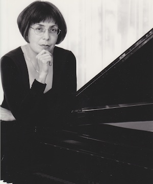

Performances
============
type: page

## May 6th, 2010 ([video 1][2010-1], [video 2][2010-2], [video 3][2010-3])

- S. Prokofiev – Tales of the Old Grandmother, op. 31
- F. Chopin – Nocturne op. 9
- F. Chopin – Impromptus op. 29, op. 36 and op. 51 and Fantasie-Impromptu, op. 66
- F. Chopin – Ballade no. 3, op. 47 and
- A. Scriabin – Six Preludes, op. 11

[2010-1]: http://vimeo.com/11754832
[2010-2]: http://vimeo.com/11733941
[2010-3]: http://vimeo.com/11727816

## February 8th, 2009 ([videos][2009])

- Four Mazurkas, Op. 30 — Allegretto non tanto, Vivace, Allegro non troppo, Allegretto
- Ballade No. 1 in G minor, Op. 23
- Nocturne in F major, Op. 15
- Ballade No. 2 in F major, Op. 38 at 4:20
- Nocturne in C# minor, Op. Posthumous
- Ballade No. 3 in Ab major, Op. 47 at 4:00
- Four Mazurkas, Op. 41 — Maestoso, Andantino, Animato, Allegretto
- Ballade No. 4 in F minor, Op. 52

[2009]: http://www.youtube.com/view_play_list?p=A79AC25CCC68C5CA
 
## November 4th, 2007 ([videos][2007])

- Three Contradances — L. van Beethoven
- Sonata in G minor, Hob. XVI 44 — J. Haydn
- Visions Fugitives, Op. 22 — S. Prokofiev
- Sonata in Eb major, Op. posth, 122 — F. Schubert
- Impromptu in Bb major, Op. 142, No. 3 — F. Schubert

[2007]: http://www.youtube.com/view_play_list?p=AE0DA4D5E1B496BC

## October 12th, 2003

**An Evening of Chamber Music Dedicated to the 95th Birthday of David Oistrach**

- Sonata No. 1 for Violin and Piano — J. S. Bach
- Sonata No. 4 for Violin and Piano in A minor, Op. 23 — L. van Beethoven
- Sonata No. 2 for Violin and Piano in A major, Op. 100 — J. Brahms
- Sonata in A major for Violin and Piano — C. Frank

*Performers Elena Stepanova, Oleg Stepanov and Victoria Smus*

## May 4th, 2003

**An Evening of Chamber Music**

- Concerto for Two Violins and Orchestra in D minor BWV1043 — J. S. Bach
- Sonata for Violin and Piano in A minor, Op. 137, No. 2 — F. Schubert
- Sonata for Violin and Piano in A major, Op. 100, No. 2 — J. Brahms
- Ragtime for Two Violins and Piano — S. Joplin
- Smoke Gets in your Eyes — J. Kern
- Souvenier for Two Violins and Piano — I. Frolov

*Performers Elena Stepanova, Oleg Stepanov and Victoria Smus*

## March 12th, 2000

- Sonata Op. 13 — L. van Beethoven
- Romance in F# major, Op. 28. Arabesque Op. 19. Carnival Jest from Vienna, Op. 26 — F. Schumann
- November 28th, 1999
- Sonata Hob. XVI 34, E minor — J. Haydn
- Sonata Hob. XVI 49, Eb major — J. Haydn
- Sonata Op. 110, Ab major — L. van Beethoven
- Four Impromptus Op. 90 — F. Schubert
 

## May 23rd, 1998

**Six Piano Sonatas by W. A. Mozart**

- Sonata in A major, K331.
- Sonata in F major, K332.
- Sonata in Bb major, K333.
- Sonata in A minor, K310.
- Sonata Facile in C major, K545.
- Sonata in Bb major K570

## July 6th, 1997 ([recordings][1997])

- Chromatic Fantasie and Fugue — J. S. Bach
- Sonata in Eb major K282 — W. A. Mozart
- Six Moments Musical, Op. 94 — F. Schubert
- Six Pieces for Piano, Op. 118 — J. Brahms
- Tales of the Old Grandmother, Op. 31 — S. Prokofiev

[1997]: http://www.last.fm/music/Victoria+Smus/Recital+at+Tom+Lee+Hall.+July+6%2C+1997

# June 29th, 1996

- Fantasia in D minor KV397, Rondo in D major KV 485, Adagio in B minor KV540, Allegro in Bb major KV400 — W. A. Mozart
- Impromptu Op. 142 No. 3 in Bb major, Sonata Op. posth 120, DV664 in A major — F. Schubert
- Fantasia in F minor, Op. 49 — F. Chopin
- Children’s Corner, L’isle Joyese — C. Debussy
- May 19th, 1996
- “The Enchantment of the Past”, Old Russian Songs

*Performers Svetlana Sosnova, Galina Jitlina and Victoria Smus*

## March 11th, 1995

- Du Bist Die Ruh, Auf Den Wasser Zu Singen, Gretchen Am Spinnrade — F. Schubert
- Mondnacht, Fruhlingsnacht, Widmung — R. Schumann
- Fantasiestucke Op. 12 — R. Schumann
- Variationen Uber Ein Thema von Robert Schumann — J. Brahms
- Heimkehr, Allerseeleny, Heimliche Aufforderung, Zueignung — R. Strauss
- Mazurkas Op. 63, No. 2 and 3, Fantasie Impromptu, Etudes Op. 25, No 1 and 2, Ballades No 1 and 4 — F. Chopin

*Performers Sharon Wishart and Victoria Smus*

## April 15th, 1994

- Carnival Jest from Vienna, Fantastic Pictures Op. 26 — R. Schumann
- Variationen uber ein Thema von Robert Schumann, Op. 9 — J. Brahms
- Visions Fugitives, Op. 22 — S. Prokofiev
- L’isle Joyeuse — C. Debussy

## April 20th, 1993

- Variations “Lison Dormait” KV264 — W. A. Mozart
- Sonatina (Modere, Mouvt de Menuet, Anime) — M. Ravel
- Impromptu Op. 29, Impromptu Op. 36, Impromptu Op. 51, Impromptu Op. 66 — F. Chopin
- Sonate Op. 58 — F. Chopin

## February 6th, 1993

- Fantastic Pieces, op. 12 — R. Schumann
- Piano Transcription of Schubert Songs (Barcarolle, Spring Hopes, Margerita at the Spinning Wheel, At the Sea, Shelter) — F. Liszt
- Sonata Op. 58 in B minor (Allegro maestoso, Scherzo molto vivace, Largo, Finale: Presto ma non tanto) — F. Chopin
 

# February 7th, 1992

- Der Hirt auf dem Felsen for Voice, Clarinet and Piano — F. Schubert
- Seven Songs for Voice and Piano — S. Rachmaninoff
- Trio in A minor for Clarinet, Cello and Piano — J. Brahms

*Performers Margherita Noye, Soprano. Wesley Foster, Clarinet. Victoria Smus, Piano. Eugene Osadchy, Cello.*
